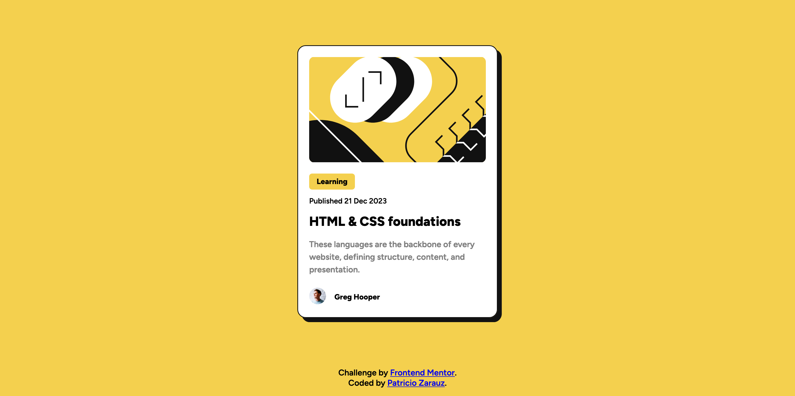
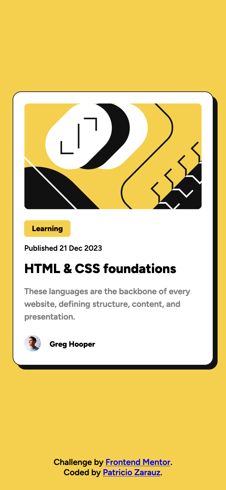

# Frontend Mentor - Blog preview card solution

This is a solution to the [Blog preview card challenge on Frontend Mentor](https://www.frontendmentor.io/challenges/blog-preview-card-ckPaj01IcS). Frontend Mentor challenges help you improve your coding skills by building realistic projects.

## Table of contents

- [Frontend Mentor - Blog preview card solution](#frontend-mentor---blog-preview-card-solution)
  - [Table of contents](#table-of-contents)
  - [Overview](#overview)
    - [The challenge](#the-challenge)
    - [Screenshot](#screenshot)
    - [Links](#links)
  - [My process](#my-process)
    - [Built with](#built-with)
    - [What I learned](#what-i-learned)
    - [Continued development](#continued-development)
    - [Useful resources](#useful-resources)
  - [Author](#author)

## Overview

### The challenge

Users should be able to:

- See hover and focus states for all interactive elements on the page

### Screenshot

Desktop view:

Mobile view:

### Links

- Solution URL: [Repo](https://github.com/PatricioZarauz/blog-preview-card-main)
- Live Site URL: [live site URL](https://blog-preview-card-main-ten-vert.vercel.app/)

## My process

### Built with

- Semantic HTML5 markup
- Flexbox
- CSS Grid
- CSS transitions
- SASS
- Custom fonts
- Mobile-first workflow

### What I learned

I learned to use css transitions, for animations.

### Continued development

I would like to improve my skills with css animations.

### Useful resources

- [CSS Tricks](https://css-tricks.com/4-ways-to-animate-the-color-of-a-text-link-on-hover/) - This helped me with the text color animation.

## Author

- Website - [GitHub](https://github.com/PatricioZarauz)
- Frontend Mentor - [@PatricioZarauz](https://www.frontendmentor.io/profile/PatricioZarauz)
